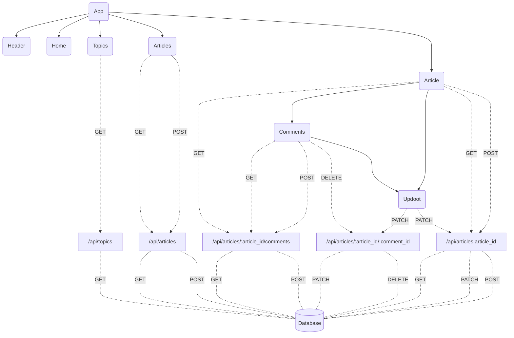

```mermaid
flowchart TB


A(App)

HE(Header)
H(Home)
Ar(Articles)
Arid(Article)
Arc(Comments)
UD(Updoot)
To(Topics)


A --> HE
A --> H
A --> Ar
A --> Arid
A --> To


Arid ---> Arc
Arc & Arid---> UD

To -.GET......-> TO
Ar -. GET ......-> AR
Ar -. POST ......-> AR
Arid -. GET..-> ARC
Arc -. GET..-> ARC
Arc -. POST ...-> ARC
Arc -. DELETE..-> ARCID
UD -. PATCH.-> ARID & ARCID
Arid -. GET..-> ARID
Arid -. POST..-> ARID


TO -.GET...-DB
AR -.GET...-DB
AR -.POST...-DB
ARC -. GET ...-DB
ARC -. POST ...-DB
ARCID -. PATCH ...-DB
ARCID -. DELETE ...-DB
ARID -. GET ...-DB
ARID -. PATCH .- DB
ARID -. POST .- DB


TO["/api/topics"]
ARC["/api/articles/:article_id/comments"]
ARCID["/api/articles/:article_id/:comment_id"]
AR["/api/articles"]
ARID["/api/articles:article_id"]

DB[(Database)]


```
